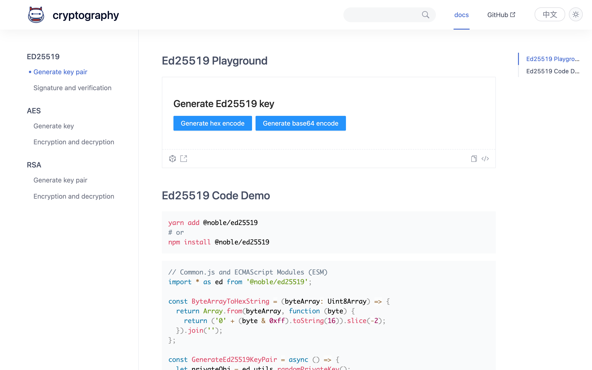

# cryptography

## TODO

- [x] Hash MD5/SHA1/SHA2/SHA3/Keccak/Ripemd
- [x] SM2/SM3/SM4
- [x] X25519/Ed25519
- [x] RSA
- [x] AES
- [ ] secp256k1
- [x] HKDF
- [ ] PBKDF2
- [ ] OTP (TOTP/HOTP)

## Getting Started

- 🌍 Online version crypto-online
- 💻 Desktop version CryptoBox

## Online Website

- http://crypto-online.cn/
- Or https://istommao.github.io/Cryptography/

## 💻 Desktop version CryptoBox

- Github: https://github.com/istommao/CryptoBox
- Download: https://github.com/istommao/CryptoBox/releases

